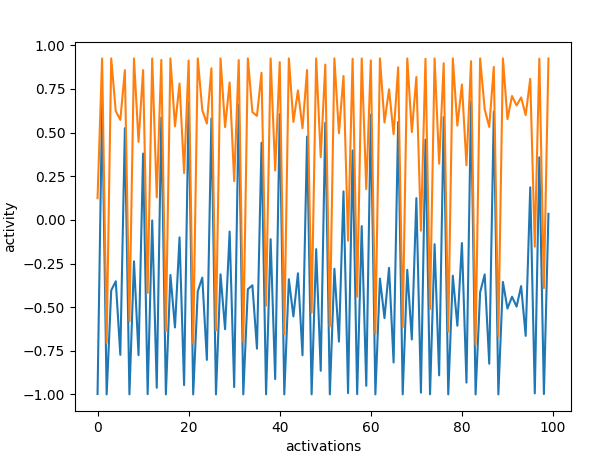
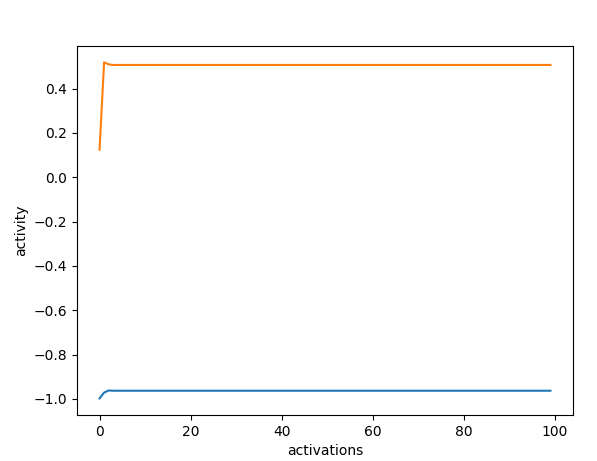

# Reservoir fix points

This was a little project where I generated a reservoir (fully connected neurons without layers) without learning and
given start values.
This ends up with chaotic activations over time.

In the second version I put the eigenvalues of the linear jacoby matrix smaller than one to get fix activations after
time.

